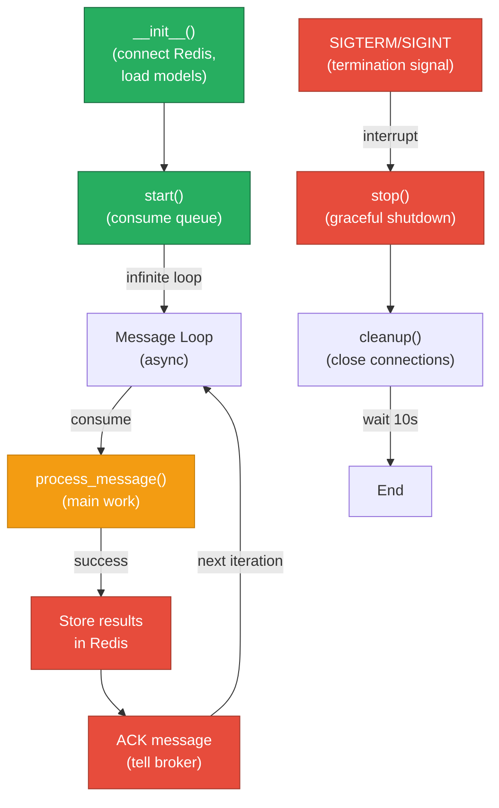

# Command & Worker Architecture

## Module Purpose

Distributed workers implementing the business logic. Each worker is a RabbitMQ consumer specializing in one task: extraction, embeddings, entities, metadata, inferences, or completion. Also includes CLI tools and the orchestrator HTTP server.

## Workers Overview

Six independent workers process documents in parallel:

| Worker | Input | Output | Dependencies | Optional | Concurrency |
|--------|-------|--------|--------------|----------|-------------|
| **Extraction** | document bytes | text, chunks, source_class | Docling, exiftool | No (first step) | async I/O |
| **Embeddings** | text | embeddings (1024-dim vector) | BAAI/bge-m3 model | No (default) | batch processing |
| **Entities** | text | entities (NER) | GLiNER model | No (default) | batch processing |
| **Metadata** | text | metadata (analytics) | None (heuristic) | No (default) | async |
| **Inference** | chunks + entities | inferences (facts) | vLLM service | Yes (optional) | sequential |
| **Completion** | job events | finalized results | None | No (aggregator) | async I/O |

## Worker Lifecycle



## Extraction Worker

**Input**: `extract_text` queue → DocumentMessage (base64 or URL)
**Output**: Redis keys + publish to embeddings/entities/metadata/inferences

**Process**:
1. Receive document (PDF, DOCX, etc.)
2. Call Docling service → raw text + metadata
3. Chunk text (sliding window, 512 tokens default)
4. Classify source (journal article, news, etc.)
5. Extract metadata (language, length, keywords)
6. Store text, chunks refs (FS artifact store)
7. Publish to downstream queues (embeddings, entities, metadata, inferences if enabled)
8. ACK message

**Error Handling**:
- Docling timeout → Retry with backoff (3x)
- Invalid document → Log, NACK, dead-letter
- Redis connection loss → Exponential backoff, circuit breaker

**Metrics**:
- `extraction_worker_jobs_total{status="success|failure"}`
- `extraction_worker_job_duration_seconds` (histogram)
- `extraction_worker_docling_calls_total`

## Embeddings Worker

**Input**: `embeddings` queue → Text
**Output**: Redis `embeddings` key (artifact store ref `sha256:`) + signal completion

**Process**:
1. Load BAAI/bge-m3 model (1024-dim, 48 attention heads)
2. Receive text chunks
3. Embed each chunk → float32 vector
4. Average vectors (if multiple chunks) → single 1024-dim vector
5. Store embeddings ref in Redis
6. Update step status → "completed"
7. ACK message

**Model Details**:
- **Model**: BAAI/bge-m3 (multilingual, 568M params)
- **Dimension**: 1024
- **Batch size**: 32 (configurable)
- **Max sequence length**: 8192
- **Offline mode**: `HF_HUB_OFFLINE=1 TRANSFORMERS_OFFLINE=1` + local model files

**Error Handling**:
- OOM (out of memory) → Reduce batch size, NACK without requeue
- Model loading → Retry, fail fast if weights missing
- CUDA unavailable → Fall back to CPU (slower but works)

**Metrics**:
- `embeddings_worker_jobs_total{status="success|oom|cuda_error"}`
- `embeddings_worker_job_duration_seconds`
- `embeddings_worker_batch_size` (gauge)

## Entities Worker

**Input**: `entities` queue → Text
**Output**: Redis `entities` key + signal completion

**Process**:
1. Load GLiNER model (small v2.1, 13M params)
   - Backbone: DeBERTa-v3-small
   - Task-oriented NER (zero-shot capable)
2. Receive text
3. Extract entities → label + confidence
4. Filter by confidence threshold (default 0.5)
5. Store in Redis
6. Update step status → "completed"
7. ACK message

**Labels Supported**:
- PERSON, ORGANIZATION, LOCATION, PRODUCT, EVENT, TIME, QUANTITY, LANGUAGE, SKILL, CONCEPT

**Model Details**:
- **Model**: GLiNER small v2.1
- **Backbone**: DeBERTa-v3-small (config.json, pytorch_model.bin, spm.model)
- **Batch size**: 16 (configurable)
- **Confidence threshold**: 0.5 (configurable)
- **Offline mode**: `HF_HUB_OFFLINE=1` + mount `/models/gliner` and `/models/deberta-v3-small`

**Error Handling**:
- Model missing → Log error, fail
- GPU OOM → Fall back to CPU (very slow)
- Empty text → Return empty entity list

**Critical Note**: This worker runs offline (no internet access required). All models must be pre-downloaded and mounted.

**Metrics**:
- `entities_worker_jobs_total{status="success|model_error"}`
- `entities_worker_job_duration_seconds`
- `entities_worker_entities_extracted` (counter per job)

## Metadata Worker

**Input**: `metadata` queue → Text
**Output**: Redis `metadata` key + signal completion

**Process**:
1. Receive text
2. Compute heuristics:
   - Language detection (via character distribution or ML)
   - Keyword extraction (TF-IDF or frequency-based)
   - Readability score (Flesch-Kincaid)
   - Word count, sentence count, avg word length
   - Named entity frequency (from entities worker, if available)
3. Store JSON metadata in Redis
4. Update step status → "completed"
5. ACK message

**Output Structure**:
```json
{
  "language": "en",
  "word_count": 1250,
  "sentence_count": 45,
  "avg_word_length": 5.2,
  "readability_score": 65.3,
  "keywords": ["machine learning", "neural networks", "classification"],
  "keyword_count": 12,
  "entity_frequency": {"PERSON": 8, "ORGANIZATION": 3}
}
```

**Error Handling**:
- Unicode errors → Sanitize, log warning
- Timeout (large text) → Async processing, no timeout

**Metrics**:
- `metadata_worker_jobs_total{status="success"}`
- `metadata_worker_job_duration_seconds`

## Inference Worker

**Input**: `inferences` queue → Chunks + entities (optional)
**Output**: Redis `inferences` key + signal completion

**Process**:
1. Connect to vLLM service (via REST API)
2. Receive text chunks + extracted entities
3. For each chunk:
   - Build prompt: "Extract key facts from: {chunk}"
   - Call vLLM → LLM generates facts
   - Parse response → structured facts with confidence
4. Store facts in Redis
5. Update step status → "completed"
6. ACK message

**Dependencies**:
- vLLM service running (port 8000 default)
- LLM model loaded (e.g., Mistral, Llama2, or quantized variant)
- vLLM endpoint configured via `LLM_URL` env var

**Error Handling**:
- vLLM unavailable → Circuit breaker + timeout (30s)
- Model context limit exceeded → Chunk text, retry
- Invalid JSON response → Log, retry with different prompt
- Timeout after 3 retries → Mark step as "skipped" (graceful degradation)

**Metrics**:
- `inference_worker_jobs_total{status="success|timeout|circuit_open"}`
- `inference_worker_job_duration_seconds`
- `inference_worker_llm_calls_total`

## Completion Worker

**Input**: Redis pub/sub `job:events` + watch all jobs
**Output**: Finalize job, save results file, call webhook

**Process**:
1. Subscribe to `job:events` channel
2. For each job event:
   - Poll Redis for all step statuses (extraction, embeddings, entities, metadata, inferences)
   - If all required steps "completed":
     - Aggregate results → JobResults JSON
     - Save to file (S3, local, or temp storage)
     - Call webhook (if configured)
     - Mark job status → "completed"
     - Update `updated_at` timestamp
   - If any step "failed":
     - Mark job status → "failed"
     - Populate error field
     - Still call webhook (with error)
3. Handle timeouts (job > JOB_TIMEOUT) → Mark failed
4. Async I/O (no blocking)

**Webhook Payload** (POST to `WEBHOOK_URL`):
```json
{
  "job_id": "abc123",
  "status": "completed",
  "results": {
    "text": "...",
    "chunks": [...],
    "embeddings": {...},
    "entities": [...],
    "metadata": {...},
    "inferences": [...]
  },
  "completed_at": "2024-01-15T10:30:00Z"
}
```

**Error Handling**:
- Webhook timeout → Retry 3x with exponential backoff
- Webhook failure (5xx) → Log, don't block job completion
- S3 unavailable → Fall back to local temp storage

**Metrics**:
- `completion_worker_jobs_finalized_total{status="completed|failed"}`
- `completion_worker_webhook_calls_total{status="success|timeout|failure"}`
- `completion_worker_job_duration_seconds`

## RabbitMQ Queue Configuration

```
Queue Configuration:

extract_text:
  - Durable: yes
  - Prefetch: 3 messages per worker
  - Max retries: 3
  - Dead-letter exchange: extract_text.dlx

embeddings:
  - Durable: yes
  - Prefetch: 5 (can batch)
  - Max retries: 2
  - Dead-letter: embeddings.dlx

entities:
  - Durable: yes
  - Prefetch: 5
  - Max retries: 2
  - Dead-letter: entities.dlx

metadata:
  - Durable: yes
  - Prefetch: 5
  - Max retries: 2
  - Dead-letter: metadata.dlx

inferences:
  - Durable: yes
  - Prefetch: 1 (sequential, vLLM bottleneck)
  - Max retries: 1 (circuit breaker after)
  - Dead-letter: inferences.dlx

Dead-letter queues (dlx):
  - TTL: 1 hour
  - Purpose: Failed messages for manual retry or analysis
```

## Model Files (Air-Gapped Deployment)

For offline operation, download and mount model directories **before** building Docker images:

```bash
# Local model cache
mkdir -p /models

# Embeddings model
huggingface-cli download BAAI/bge-m3 --local-dir /models/bge-m3

# Entities models (backbone + extractor)
huggingface-cli download microsoft/deberta-v3-small --local-dir /models/deberta-v3-small
huggingface-cli download urchade/gliner-small-v2.1 --local-dir /models/gliner-small-v2.1

# Alternative: modern-gliner (if using)
huggingface-cli download DeploymentDuck/modern-gliner --local-dir /models/modern-gliner
```

**Docker Compose**:
```yaml
embeddings-worker:
  image: embeddings-worker:latest
  volumes:
    - /models/bge-m3:/models/bge-m3:ro
  environment:
    HF_HUB_OFFLINE: 1
    TRANSFORMERS_OFFLINE: 1

entities-worker:
  image: entities-worker:latest
  volumes:
    - /models/deberta-v3-small:/models/deberta-v3-small:ro
    - /models/gliner-small-v2.1:/models/gliner-small-v2.1:ro
  environment:
    HF_HUB_OFFLINE: 1
    TRANSFORMERS_OFFLINE: 1
```

**Build without internet**:
```dockerfile
# Pre-download during build stage (on internet-connected machine)
FROM python:3.11 as download
RUN pip install huggingface_hub
RUN huggingface-cli download BAAI/bge-m3

# Runtime stage (air-gapped)
FROM python:3.11
COPY --from=download /root/.cache/huggingface /models
ENV HF_HUB_OFFLINE=1
ENV TRANSFORMERS_OFFLINE=1
COPY embeddings_worker.py /app/
CMD ["python", "embeddings_worker.py"]
```

**Verification (air-gapped)**:
```bash
docker run --network=none \
  -v /models/bge-m3:/models/bge-m3:ro \
  -v /models/gliner:/models/gliner:ro \
  embeddings-worker python -c "from sentence_transformers import SentenceTransformer; model = SentenceTransformer('/models/bge-m3')"

docker run --network=none \
  -v /models/gliner:/models/gliner:ro \
  entities-worker python -c "from gliner import GLiNER; model = GLiNER.from_pretrained('/models/gliner')"
```

## Error Handling Strategy

All workers follow the same pattern:

```
Message received
    ↓
Try: parse & validate
    ├─ Parse error → Log (error), NACK no requeue → Dead-letter
    ├─ Validation error → Log (warning), NACK no requeue → Dead-letter
    └─ OK → continue
    ↓
Try: process
    ├─ Transient error (timeout, network) → Log (warning), NACK with requeue → Retry later
    ├─ Permanent error (model missing, OOM) → Log (error), NACK no requeue → Dead-letter
    └─ OK → continue
    ↓
Try: store in Redis
    ├─ Connection lost → Log (error), NACK with requeue → Retry
    └─ OK → continue
    ↓
ACK message (tell RabbitMQ "processed")
    ↓
Update job status in Redis (step completed)
```

**Example: vLLM unavailable**
- Inference worker detects timeout
- Circuit breaker opens (future requests blocked)
- Current message: NACK with requeue
- Job status: "inferences" → "skipped" (graceful degradation)
- Result: Job completes without inferences (other steps still succeed)

**Example: Docling service down**
- Extraction worker fails to connect
- Retry 3x with exponential backoff (1s, 2s, 4s)
- After 3 failures: NACK no requeue → Dead-letter
- Job status: "failed" with error message
- Webhook called with error

## Metrics Collection

Each worker exports Prometheus metrics at `/metrics` endpoint:

```
extraction_worker_jobs_total{status="success"} 1250
extraction_worker_jobs_total{status="failure"} 12
extraction_worker_job_duration_seconds_bucket{le="1.0"} 150
extraction_worker_job_duration_seconds_bucket{le="5.0"} 300
extraction_worker_docling_calls_total 1250
extraction_worker_docling_errors_total{error="timeout"} 5

embeddings_worker_jobs_total{status="success"} 1248
embeddings_worker_jobs_total{status="oom"} 2
embeddings_worker_job_duration_seconds_bucket{le="1.0"} 800
embeddings_worker_batch_size 32

entities_worker_jobs_total{status="success"} 1248
entities_worker_entities_extracted 45230
entities_worker_job_duration_seconds_bucket{le="0.5"} 1000

metadata_worker_jobs_total{status="success"} 1248
metadata_worker_job_duration_seconds_bucket{le="0.1"} 1200

inference_worker_jobs_total{status="success"} 300
inference_worker_jobs_total{status="circuit_open"} 50
inference_worker_llm_calls_total 300

completion_worker_jobs_finalized_total{status="completed"} 1240
completion_worker_jobs_finalized_total{status="failed"} 8
completion_worker_webhook_calls_total{status="success"} 1240
completion_worker_webhook_calls_total{status="timeout"} 2
```

## Scaling & Deployment

**Horizontal Scaling**:
```bash
# Start 3 instances of embeddings worker (parallel processing)
docker run embeddings-worker &
docker run embeddings-worker &
docker run embeddings-worker &

# RabbitMQ distributes messages round-robin
# All 3 share the same queue
```

**Kubernetes Deployment**:
```yaml
apiVersion: apps/v1
kind: Deployment
metadata:
  name: embeddings-worker
spec:
  replicas: 3  # Autoscale based on queue depth
  selector:
    matchLabels:
      app: embeddings-worker
  template:
    metadata:
      labels:
        app: embeddings-worker
    spec:
      containers:
      - name: embeddings-worker
        image: embeddings-worker:latest
        resources:
          limits:
            memory: "8Gi"
            nvidia.com/gpu: 1
          requests:
            memory: "6Gi"
      affinity:
        nodeAffinity:
          requiredDuringScheduling:
          - key: node.kubernetes.io/gpu
            operator: In
            values: ["true"]
```

**Resource Requirements**:
- Embeddings: 6-8 GB RAM, 1 GPU (optional, CPU fallback)
- Entities: 4-6 GB RAM, 1 GPU (optional, CPU fallback)
- Extraction: 2-4 GB RAM, CPU-only (I/O bound)
- Metadata: 1-2 GB RAM, CPU-only
- Inference: 8-16 GB RAM (depends on LLM size), vLLM service manages GPU

## Idempotency & Crash Recovery

Workers are safe to restart:

1. **Redis acknowledgment persists**: Job state saved before ACK
2. **Message requeue**: If worker crashes before ACK, RabbitMQ resends message
3. **Duplicate handling**: Job ID + step name uniquely identify work
   - If processing same job again, overwrites previous results (safe)
   - Deduplication via cache key (SHA-256 of input)
4. **TTL cleanup**: Redis keys (refs, control) expire after 24h via jobTTL; FS artifact store blobs do not expire

**Crash Scenario**:
```
embeddings-worker:
  ├─ Load model
  ├─ Receive message (job abc123)
  ├─ Process → embed text
  ├─ Store in Redis
  ├─ CRASH (before ACK)
  └─ (process dies)

RabbitMQ:
  ├─ Message not ACKed
  ├─ After timeout (30s), requeue message
  └─ Send to another worker

New embeddings-worker:
  ├─ Receives message again
  ├─ Process → same embeddings (deterministic)
  ├─ Store in Redis (overwrites previous)
  ├─ ACK successfully
  └─ Job continues
```

Result: **No data loss, no duplicates**.
