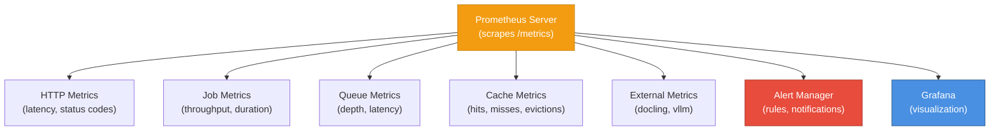
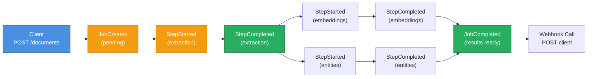

# Shared Package Architecture

## Module Purpose

Reusable infrastructure shared across Go and Python services: logging, metrics, event definitions, and common worker utilities. No business logic—purely cross-cutting concerns.

## Packages

- **logging/**: zerolog wrapper for structured logging (Go services)
- **metrics/**: Prometheus metrics registry and helpers (Go + Python)
- **events_python.py**: Event definitions and pub/sub wrapper (Python workers)
- **worker_common/base.py**: Worker base class, RabbitMQ helpers (Python workers)

## Logging Architecture

All services use `pkg/logging` which wraps **zerolog** (ultra-fast JSON logging):

### Logging Interface (Go)

```go
package logging

type Logger interface {
    Debug() LogBuilder
    Info() LogBuilder
    Warn() LogBuilder
    Error() LogBuilder
}

type LogBuilder interface {
    Str(key, value string) LogBuilder
    Int(key string, value int) LogBuilder
    Err(err error) LogBuilder
    Msg(msg string)
}
```

### Usage Examples

**Go**:
```go
logger := logging.GetLogger()

// Simple message
logger.Info().Msg("Service started")

// With fields
logger.Info().Str("job_id", jobID).Str("status", "completed").Msg("Job completed")

// With error
logger.Error().Err(err).Str("service", "docling").Msg("External service failed")

// With multiple fields
logger.Warn().
    Str("job_id", jobID).
    Int("attempt", 3).
    Int("max_retries", 3).
    Msg("Max retries exceeded")
```

**Python**:
```python
import logging
from pkg.logging import get_logger

logger = get_logger(__name__)

# Simple
logger.info("Worker started")

# Structured
logger.info("Job completed", extra={
    "job_id": job_id,
    "status": "completed",
    "duration_s": 5.2
})

# Error
try:
    result = process(data)
except Exception as e:
    logger.error(f"Processing failed: {e}", extra={"job_id": job_id})
```

### Output Format (JSON)

```json
{
  "level": "error",
  "timestamp": "2024-01-15T10:30:45.123Z",
  "message": "External service failed",
  "job_id": "abc123",
  "service": "docling",
  "error": "connection timeout"
}
```

JSON output is parseable by:
- ELK Stack (Elasticsearch + Kibana)
- Splunk
- CloudWatch
- Grafana Loki
- JSON grep tools

### Log Levels

| Level | Use Case | Example |
|-------|----------|---------|
| `Debug` | Development, variable inspection | `logger.Debug().Str("request", data).Msg("Received")` |
| `Info` | Normal operations, milestones | `logger.Info().Msg("Job created")` |
| `Warn` | Recoverable issues, degradation | `logger.Warn().Err(err).Msg("Retry")` |
| `Error` | Unrecoverable failures, alerts | `logger.Error().Err(err).Msg("Job failed")` |

**Environment Control**:
```bash
LOG_LEVEL=debug      # Verbose
LOG_LEVEL=info       # Normal (default)
LOG_LEVEL=warn       # Warnings + errors only
LOG_LEVEL=error      # Errors only
```

## Metrics Architecture

Centralized Prometheus metrics for monitoring and alerting:



### Metric Types

**Counter** (always increasing):
```go
orchestrator_jobs_created_total{feature="embeddings"}  # increments by 1 per job
extraction_worker_documents_processed_total             # total count
docling_api_calls_total{status="success"}
```

**Histogram** (latency/duration distribution):
```go
orchestrator_job_duration_seconds_bucket{le="1.0"}     # How many jobs < 1s
orchestrator_job_duration_seconds_bucket{le="5.0"}     # How many jobs < 5s
orchestrator_job_duration_seconds_bucket{le="10.0"}    # How many jobs < 10s
http_request_duration_seconds_bucket{le="0.5"}
```

**Gauge** (point-in-time value):
```go
rabbitmq_queue_depth{queue="embeddings"}               # Current queue size
redis_connected_clients                                 # Active connections
worker_memory_usage_bytes                              # Current RAM usage
```

### Metric Categories

**HTTP Metrics** (Go Orchestrator + Resource Manager):
```
http_requests_total{method="POST",path="/documents",status="200"}
http_request_duration_seconds{method="POST",path="/documents"}
http_request_size_bytes{method="POST"}
http_response_size_bytes{method="GET"}
```

**Job Metrics** (All workers):
```
extraction_worker_jobs_total{status="success|failure|timeout"}
extraction_worker_job_duration_seconds{quantile="0.5|0.9|0.99"}
embeddings_worker_jobs_total{status="success|oom"}
entities_worker_jobs_total{status="success|model_error"}
metadata_worker_jobs_total{status="success"}
inference_worker_jobs_total{status="success|circuit_open|timeout"}
completion_worker_jobs_finalized_total{status="completed|failed"}
```

**Broker Metrics** (RabbitMQ):
```
rabbitmq_queue_depth{queue="extract_text|embeddings|entities|..."}
rabbitmq_messages_published_total{queue="extract_text"}
rabbitmq_messages_consumed_total{queue="extract_text"}
rabbitmq_message_ack_total
rabbitmq_message_nack_total
rabbitmq_connection_failures_total
```

**Cache Metrics**:
```
cache_hits_total
cache_misses_total
cache_hit_ratio = hits / (hits + misses)
cache_evictions_total
cache_size_bytes
```

**External Service Metrics**:
```
docling_api_calls_total{status="success|timeout|error"}
docling_api_duration_seconds
docling_extraction_errors_total

vllm_api_calls_total{model="mistral|llama"}
vllm_api_duration_seconds
vllm_token_count_total
vllm_circuit_breaker_state{service="vllm"} # 0=closed, 1=open, 2=half-open
```

### Alerting Rules (Prometheus)

**Critical Alerts** (page on-call):
```yaml
groups:
- name: critical
  rules:
  - alert: CircuitBreakerOpen
    expr: circuit_breaker_state{service="vllm"} > 0
    for: 2m
    annotations:
      summary: "vLLM circuit breaker is open"
      
  - alert: JobFailureRate
    expr: rate(jobs_failed_total[5m]) / rate(jobs_total[5m]) > 0.1
    for: 5m
    annotations:
      summary: "Job failure rate > 10%"
      
  - alert: RabbitMQQueueBacklog
    expr: rabbitmq_queue_depth{queue="extract_text"} > 10000
    for: 10m
    annotations:
      summary: "Extraction queue backlog > 10k"
```

**Warning Alerts** (Slack notification):
```yaml
groups:
- name: warning
  rules:
  - alert: HighLatency
    expr: histogram_quantile(0.95, job_duration_seconds) > 30
    for: 15m
    annotations:
      summary: "95th percentile job latency > 30s"
      
  - alert: LowCacheHitRate
    expr: cache_hit_ratio < 0.3
    for: 30m
    annotations:
      summary: "Cache hit ratio < 30%"
```

## Event Definitions

Core event types for job lifecycle:

### Python Event Module (`pkg/events_python.py`)

```python
from enum import Enum
from dataclasses import dataclass
from datetime import datetime
from typing import Dict, Any, Optional

class EventType(Enum):
    JOB_CREATED = "job:created"
    JOB_PROGRESS = "job:progress"
    JOB_COMPLETED = "job:completed"
    JOB_FAILED = "job:failed"
    STEP_STARTED = "step:started"
    STEP_COMPLETED = "step:completed"
    STEP_FAILED = "step:failed"

@dataclass
class Event:
    job_id: str
    event_type: EventType
    timestamp: datetime
    step: Optional[str] = None          # extraction, embeddings, etc.
    progress: Optional[int] = None      # 0-100
    error: Optional[str] = None
    message: str = ""
    payload: Dict[str, Any] = None

class EventBus:
    def __init__(self, redis_url: str):
        self.redis = redis.from_url(redis_url)
    
    def publish(self, event: Event) -> None:
        """Publish to job:events and job:{job_id}:events"""
        channel = f"job:{event.job_id}:events"
        self.redis.publish(channel, event.to_json())
    
    def subscribe(self, job_id: str) -> Iterator[Event]:
        """Subscribe to job-specific events"""
        pub_sub = self.redis.pubsub()
        pub_sub.subscribe(f"job:{job_id}:events")
        for message in pub_sub.listen():
            if message['type'] == 'message':
                yield Event.from_json(message['data'])
```

### Go Event Types (`internal/events/event_types.go`)

```go
type EventType string

const (
    JobCreated     EventType = "job:created"
    JobProgress    EventType = "job:progress"
    JobCompleted   EventType = "job:completed"
    JobFailed      EventType = "job:failed"
    StepStarted    EventType = "step:started"
    StepCompleted  EventType = "step:completed"
    StepFailed     EventType = "step:failed"
)

type Event struct {
    JobID     string                 `json:"job_id"`
    Type      EventType              `json:"type"`
    Timestamp time.Time              `json:"timestamp"`
    Step      string                 `json:"step,omitempty"`      // extraction, embeddings, etc.
    Progress  int                    `json:"progress,omitempty"`  // 0-100
    Error     string                 `json:"error,omitempty"`
    Message   string                 `json:"message"`
    Payload   map[string]interface{} `json:"payload,omitempty"`
}
```

### Event Flow Timeline



## Worker Base Class (Python)

All Python workers inherit from `BaseWorker`:

```python
# pkg/worker_common/base.py

class BaseWorker:
    def __init__(self, queue_name: str, redis_url: str, amqp_url: str):
        self.queue_name = queue_name
        self.redis = redis.from_url(redis_url)
        self.channel = None
        self.connection = None
        self.logger = get_logger(self.__class__.__name__)
    
    async def start(self) -> None:
        """Connect and consume messages"""
        self.connection = pika.AsyncioConnection(self.amqp_url)
        self.channel = await self.connection.channel()
        await self.channel.queue_declare(
            queue=self.queue_name,
            durable=True,
            arguments={'x-max-priority': 10}
        )
        await self.channel.basic_qos(prefetch_count=3)
        await self.channel.basic_consume(
            queue=self.queue_name,
            on_message_callback=self._on_message
        )
        self.logger.info(f"Worker started, consuming {self.queue_name}")
    
    async def _on_message(self, ch, method, properties, body: bytes) -> None:
        """Message handler (implement in subclass)"""
        try:
            message = json.loads(body)
            await self.process_message(message)
            ch.basic_ack(delivery_tag=method.delivery_tag)
        except json.JSONDecodeError as e:
            self.logger.error(f"Invalid JSON: {e}")
            ch.basic_nack(delivery_tag=method.delivery_tag, requeue=False)
        except Exception as e:
            self.logger.error(f"Processing failed: {e}")
            ch.basic_nack(delivery_tag=method.delivery_tag, requeue=True)
    
    async def process_message(self, message: dict) -> None:
        """Override in subclass"""
        raise NotImplementedError()
    
    async def stop(self) -> None:
        """Graceful shutdown"""
        await self.channel.stop_consuming()
        await self.connection.close()
```

**Subclass Example** (Embeddings Worker):
```python
class EmbeddingsWorker(BaseWorker):
    def __init__(self, *args, **kwargs):
        super().__init__("embeddings", *args, **kwargs)
        self.model = SentenceTransformer("BAAI/bge-m3")
    
    async def process_message(self, message: dict) -> None:
        job_id = message["job_id"]
        text = message["text"]
        
        # Embed
        embeddings = self.model.encode(text, convert_to_tensor=True)
        
        # Store
        self.redis.hset(
            f"orchestrator:job:{job_id}:embeddings",
            mapping={"vector": embeddings.tolist(), "model": "bge-m3"}
        )
        
        # Signal
        self.redis.hset(f"orchestrator:job:{job_id}:steps", "embeddings", "completed")
```

## Shared Constants

Common constants defined in `pkg/constants/`:

```go
// pkg/constants/job.go

const (
    JobStatusPending   = "pending"
    JobStatusProcessing = "processing"
    JobStatusCompleted = "completed"
    JobStatusFailed    = "failed"
    JobStatusTimeout   = "timeout"
    
    JobTimeout = 60 * time.Minute
    JobTTL     = 24 * time.Hour
    
    RedisNamespace = "orchestrator"
)

const (
    StepExtraction = "extraction"
    StepEmbeddings = "embeddings"
    StepEntities   = "entities"
    StepMetadata   = "metadata"
    StepInferences = "inferences"
)

const (
    QueueExtractText = "extract_text"
    QueueEmbeddings  = "embeddings"
    QueueEntities    = "entities"
    QueueMetadata    = "metadata"
    QueueInferences  = "inferences"
)
```

## Testing Helpers

Reusable test utilities in `pkg/testing/`:

```python
# pkg/testing/fixtures.py

@pytest.fixture
def redis_client(redis_server):
    """Provide a Redis client connected to test server"""
    return redis.from_url(f"redis://localhost:{redis_server.port}")

@pytest.fixture
def mock_broker():
    """Mock RabbitMQ broker"""
    with patch('pika.AsyncioConnection') as mock:
        yield mock

@pytest.fixture
def sample_job():
    """Sample job data"""
    return {
        "id": "test-job-123",
        "document": {"format": "pdf", "content": b"test"},
        "features": ["embeddings", "entities"],
        "created_at": datetime.now(),
    }

@pytest.fixture
def sample_text():
    return "John works at OpenAI. He is a machine learning engineer."
```

## Configuration Management

Shared config loading via environment variables:

```python
# pkg/config.py

from pydantic import BaseSettings

class Config(BaseSettings):
    # Redis
    redis_url: str = "redis://localhost:6379"
    
    # RabbitMQ
    rabbitmq_url: str = "amqp://localhost:5672/"
    rabbitmq_prefetch: int = 3
    
    # Timeouts
    job_timeout: str = "60m"
    job_ttl: str = "24h"
    request_timeout: int = 30
    
    # Models
    embeddings_model: str = "BAAI/bge-m3"
    entities_model: str = "urchade/gliner-small-v2.1"
    
    # External services
    docling_url: str = "http://docling:5001"
    llm_url: str = ""
    
    # Logging
    log_level: str = "info"
    
    class Config:
        env_file = ".env"
        env_prefix = ""

# Global config instance
config = Config()
```

**Load in workers**:
```python
from pkg.config import config

redis_url = config.redis_url
logger.info(f"Connecting to Redis: {redis_url}")
```

## Version Management

Semantic versioning for package compatibility:

```go
// pkg/version/version.go

const (
    Major = 1
    Minor = 0
    Patch = 0
)

var Version = fmt.Sprintf("%d.%d.%d", Major, Minor, Patch)
```

Referenced in:
- Go `go.mod`: `v1.0.0`
- Python `setup.py`: `version='1.0.0'`
- Docker image tags: `orchestrator:1.0.0`
- API `/version` endpoint: `{"version": "1.0.0"}`

## Migration Strategy

To upgrade `pkg/` components:

1. **Backward compatible change** (add optional field):
   - Patch version bump (v1.0.0 → v1.0.1)
   - No worker restart required
   - Old/new workers coexist

2. **Breaking change** (remove field):
   - Minor or major version bump (v1.0.0 → v1.1.0 or v2.0.0)
   - Requires coordinated upgrade:
     - Deploy new orchestrator
     - Deploy new workers
     - Drain old messages from queues

3. **Schema migration** (Redis key changes):
   - Run migration script (one-time)
   - Verify data integrity
   - Deploy new code

Example:
```bash
# Before upgrade
docker-compose down

# Run migration (if needed)
python pkg/migrations/001_add_llm_fields.py

# Upgrade images
docker-compose build
docker-compose up
```

## Dependency Tree

```
pkg/
├── logging/
│   └── (no dependencies)
├── metrics/
│   └── logging/
├── events_python.py
│   └── logging/
├── worker_common/base.py
│   ├── logging/
│   ├── events_python.py
│   └── config.py
├── config.py
│   └── (environment)
└── constants/
    └── (no dependencies)

internal/ (Go)
├── broker/
│   ├── config/
│   └── logging/
├── redis/
│   ├── config/
│   └── logging/
├── pipeline/
│   ├── broker/
│   ├── redis/
│   └── events/
└── ...

cmd/ (Workers)
├── embeddings-worker/
│   ├── pkg/worker_common
│   ├── pkg/logging
│   └── pkg/config
├── entities-worker/
│   └── (same)
└── ...
```

Zero circular dependencies; all layers point inward (pkg ← internal ← cmd).
