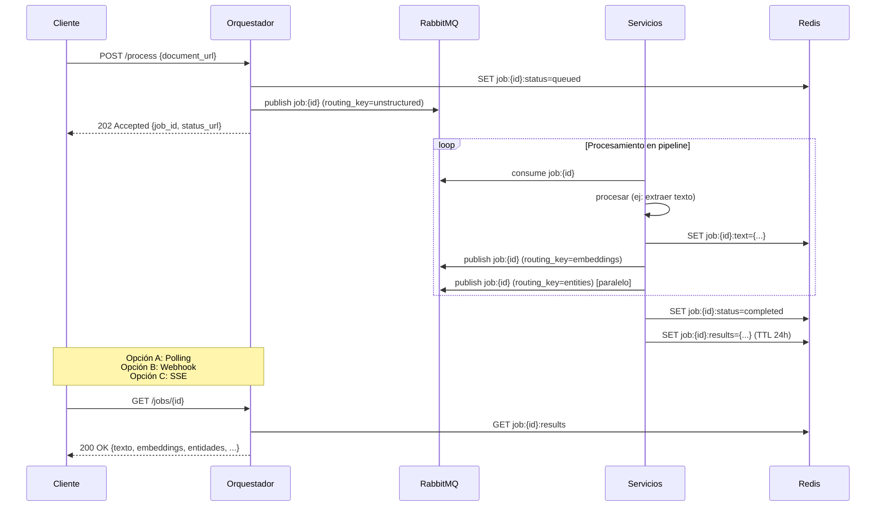

# Plan Arquitectónico: Document Processing Core

## 1. Visión General del Sistema

Sistema distribuido que orquesta múltiples servicios especializados para procesar documentos y devolver un resultado unificado (texto, embeddings, entidades NER, metadatos). Los servicios permanecen independientes pero coordinados bajo un **Orquestador Central** que expone una API unificada.

```
┌─────────────┐
│   Cliente   │
└──────┬──────┘
       │ POST /process-document {url|file}
       ▼
┌──────────────────────┐
│  ORQUESTADOR (Core)  │ ← API unificada (REST/gRPC)
└──────────┬───────────┘
           │
    ┌──────┴──────┐
    │ Message Bus │ ← RabbitMQ (cola de trabajos)
    └──────┬──────┘
           │
    ┌──────┴──────┬──────────┬──────────┐
    ▼             ▼          ▼          ▼
┌─────────┐ ┌──────────┐ ┌────────┐ ┌──────────┐
│Unstruct-│ │Embeddings│ │Entities│ │Metadata  │
│  ured   │ │ Service  │ │Service │ │Extractor │
└─────────┘ └──────────┘ └────────┘ └──────────┘
    │             │          │          │
    └─────────────┴──────────┴──────────┘
                  │
           ┌──────▼──────┐
           │   Redis     │ ← Cache compartido + estado
           └─────────────┘
```

## 2. Componentes del Sistema

| Componente | Responsabilidad | Comunicación | Tecnología Recomendada |
|------------|-----------------|--------------|------------------------|
| **Orquestador Core** | Recibe solicitudes, coordina flujo, consolida resultados, gestiona errores | Entrada: HTTP API<br>Salida: RabbitMQ + Redis | Go (alto throughput) / Python + FastAPI |
| **Message Broker** | Cola de trabajos asíncronos, desacoplamiento, backpressure | AMQP protocol | RabbitMQ (cluster) |
| **Redis Cache** | Cache de resultados intermedios, estado de jobs, rate limiting | RESP protocol | Redis Cluster (con persistencia RDB/AOF) |
| **Unstructured.io** | Extracción de texto desde documentos (PDF, DOCX, etc.) | HTTP API (externo) | Unstructured Cloud / Self-hosted |
| **Embeddings Service** | Generación de vectores a partir de texto | Consumidor RabbitMQ → Productor Redis | Python + Sentence Transformers / OpenAI API |
| **Entities Service** | NER (Named Entity Recognition) y clasificación | Consumidor RabbitMQ → Productor Redis | Python + spaCy / transformers |
| **Metadata Extractor** | Metadatos técnicos (tamaño, tipo MIME, fecha, etc.) | Consumidor RabbitMQ → Productor Redis | Python / Go |

## 3. Patrón de Comunicación: Híbrido Asíncrono

### 3.1. Flujo Principal (Async con Polling/Callbacks)



### 3.2. Decisiones Técnicas de Comunicación

| Mecanismo | Caso de Uso | Razón |
|-----------|-------------|-------|
| **RabbitMQ** | Orquestación de jobs, pipeline asíncrono | Desacoplamiento total, garantía de entrega, retries automáticos, backpressure |
| **Redis** | Cache compartido de resultados intermedios, estado de jobs | Baja latencia (<1ms), estructuras de datos ricas (hashes), TTL automático |
| **HTTP API Directa** | Solo para Unstructured (externo) | Servicio externo no controlado; no usar para comunicación interna |
| **WebSockets/SSE** | Notificaciones en tiempo real (opcional) | Mejor UX para clientes que esperan resultados |

> ✅ **NO usar bases de datos relacionales para orquestación** (latencia alta, acoplamiento)

## 4. Contratos de Mensajería

### 4.1. Estructura de Mensaje en RabbitMQ

```json
{
  "job_id": "uuid4",
  "step": "extract_text | generate_embeddings | extract_entities",
  "document_url": "https://...",
  "text_hash": "sha256:...", // para cache
  "metadata": {
    "priority": "normal|high",
    "client_id": "optional",
    "callback_url": "https://cliente/webhook"
  },
  "retries": 0,
  "created_at": "ISO8601"
}
```

### 4.2. Estructura en Redis (por job_id)

```bash
# Hash con todos los resultados
job:{job_id}:results = {
  text: "contenido extraído...",
  embeddings: "[0.23, -0.45, ...]",
  entities: "[{type:'PERSON', text:'Ana', ...}]",
  metadata: "{mime_type:'application/pdf', ...}"
}

# Estado separado (para polling rápido)
job:{job_id}:status = "queued|processing|completed|failed"
job:{job_id}:error = "mensaje de error opcional"

# TTL automático (24h)
EXPIRE job:{job_id}:results 86400
```

## 5. Resiliencia y Gestión de Errores

### 5.1. Patrón Saga Orchestrator

- El orquestador mantiene el estado del job
- En fallo de un paso: **compensación** (borrar resultados parciales en Redis)
- Reintentos con backoff exponencial (max 3 intentos por paso)
- Dead Letter Exchange (DLX) en RabbitMQ para mensajes fallidos persistentes

### 5.2. Circuit Breaker (por servicio)

```go
// Ejemplo conceptual en Go
breaker := gobreaker.NewCircuitBreaker(gobreaker.Settings{
    Name: "embeddings-service",
    MaxRequests: 3, // mínimas reqs para probar cierre
    Interval: 5 * time.Minute, // ventana de fallos
    Timeout: 10 * time.Second, // tiempo en estado abierto
})
```

## 6. API del Orquestador

### 6.1. Endpoints Principales

```http
POST /v1/documents/process
Content-Type: application/json

{
  "document_url": "https://ejemplo.com/doc.pdf",
  // o
  "document_base64": "JVBERi0xLjQKJ...",
  "webhook_url": "https://cliente.com/callback", // opcional
  "priority": "normal|high"
}
→ 202 Accepted { "job_id": "abc123", "status_url": "/v1/jobs/abc123" }

GET /v1/jobs/{job_id}
→ 200 OK { "status": "completed", "results": { ... } }
→ 202 Accepted { "status": "processing", "progress": 67 }
→ 404 Not Found (job expirado)

DELETE /v1/jobs/{job_id} // cancelar job en curso
```

### 6.2. Webhook (opcional)

```http
POST {webhook_url}
Content-Type: application/json

{
  "job_id": "abc123",
  "event": "completed|failed",
  "results": { ... } // solo si completed
}
```

## 7. Stack Tecnológico Recomendado

| Capa | Tecnología | Razón |
|------|------------|-------|
| Orquestador | **Go** (Gin/Echo) | Alto throughput, bajo consumo memoria, concurrencia nativa |
| Workers | Python 3.11+ | Ecosistema NLP/ML maduro (spaCy, transformers) |
| Message Broker | RabbitMQ 3.12+ | Estabilidad, DLX, plugins de monitorización |
| Cache/Estado | Redis 7.x | Baja latencia, pub/sub para notificaciones, TTL |
| Observabilidad | Prometheus + Grafana + OpenTelemetry | Métricas, logs, traces distribuidos |
| Orquestación | Docker Compose (dev) / Kubernetes (prod) | Escalado horizontal de workers |

## 8. Roadmap de Implementación

### Fase 1 (Semanas 1-2)
- [ ] Implementar Orquestador con API REST básica
- [ ] Configurar RabbitMQ + colas por servicio (`unstructured`, `embeddings`, `entities`)
- [ ] Configurar Redis para estado de jobs
- [ ] Integrar Unstructured.io (llamada HTTP síncrona inicial)

### Fase 2 (Semanas 3-4)
- [ ] Desarrollar workers para Embeddings y Entities como consumidores RabbitMQ
- [ ] Implementar cache en Redis por hash de texto (evitar reprocesar)
- [ ] Sistema de retries + DLX para fallos persistentes

### Fase 3 (Semana 5)
- [ ] Implementar polling + webhooks para notificaciones
- [ ] Circuit breakers por servicio
- [ ] Métricas básicas (jobs procesados, latencia por paso, fallos)

### Fase 4 (Semana 6+)
- [ ] Optimizaciones: procesamiento paralelo de embeddings/entidades
- [ ] Rate limiting por cliente (Redis + token bucket)
- [ ] Escalado horizontal de workers (Kubernetes HPA)

## 9. Consideraciones Críticas

⚠️ **Evitar anti-patrones:**
- No usar llamadas HTTP síncronas entre servicios internos (acoplamiento, timeouts en cascada)
- No almacenar estado en memoria del orquestador (debe ser stateless)
- No usar base de datos relacional como cola de mensajes (alto acoplamiento, baja performance)

✅ **Buenas prácticas:**
- Todos los servicios deben ser **stateless** (estado en Redis/RabbitMQ)
- Usar **hash de contenido** para evitar reprocesar documentos idénticos
- TTL estricto en Redis para evitar memory leaks
- Idempotencia en todos los workers (mismo job_id → mismo resultado)

## 10. Métricas Clave a Monitorizar

| Métrica | Alerta si... |
|---------|--------------|
| `jobs_queue_length` | > 1000 durante 5 min |
| `job_processing_time_p95` | > 30s (embeddings) / > 10s (entidades) |
| `service_error_rate` | > 5% durante 1 min |
| `redis_memory_usage` | > 80% capacidad |
| `rabbitmq_unacked_messages` | crecimiento sostenido (>100/min) |

---